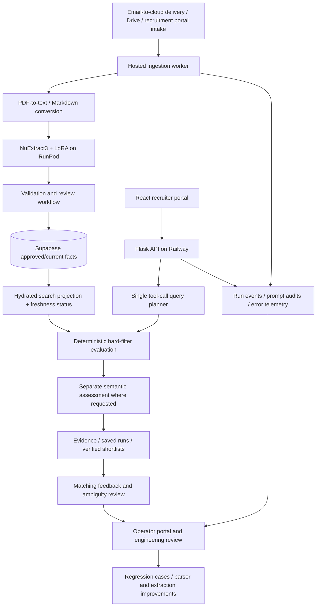

# NjordHR

### AI recruitment and document intelligence

NjordHR turns unstructured maritime resumes into structured candidate facts and helps recruiters search, review, and shortlist candidates using natural language.

This repository is a public technical showcase of a privately developed application. It contains an architecture overview, bounded evaluation results, and an executable example with entirely synthetic data. It is not the production application or a release of its training corpus.

## Engineering highlights

- **End-to-end product:** React/TypeScript customer and operator interfaces, Python/Flask APIs, hosted background workers, Supabase persistence, and RunPod GPU inference.
- **Domain extraction:** fine-tuned NuExtract3 with PyTorch and PEFT/LoRA on **1,463 examples**, using **24,576-token training context** and **0.466% trainable parameters**; evaluated on **469 validation documents**.
- **Natural-language search:** evaluated **8 LLMs on an 80-prompt benchmark**; the parser produces a structured search plan through **one schema-validated tool call**. Separate stages enforce hard filters and assess soft criteria.
- **Measured parser quality:** the best recorded rescored run achieved **99.1% filter-level F1** and **96.7% filter exact match** across **240 cases (80 prompts × 3 repeats)**. These are historical parser benchmark results, not end-to-end matching accuracy.
- **Retrieval validation:** historical needle-in-a-haystack testing found the intended candidate in **13/13 trials against a 4,967-candidate corpus**; this is a bounded historical experiment, not a current corpus-size claim.
- **Document-quality investigation:** compared OCR approaches on a frozen **200-document, 663-page** challenge cohort; separated transcription loss, table-attachment errors, parser issues, and reference-label disagreements.
- **Operational feedback:** error/run logs, prompt audits, matching-review feedback, and model/evaluation records support diagnosis, regression coverage, and future improvements.

## Product workflows

| Customer / recruiter | Operator / administrator |
|---|---|
| Describe candidate requirements in natural language | Monitor document ingestion and extraction |
| Inspect explicit filters and candidate evidence | Investigate errors and unsupported queries |
| Review results and refine search runs | Review candidate facts before search eligibility |
| Manage verified shortlists and export records | Inspect evaluation history and runtime settings |

## Architecture

The active hosted search path evaluates hard requirements over approved facts. Earlier Gemini-embedding/Pinecone retrieval work is historical and is not the authority for current candidate eligibility.

## Explore the work

- [Architecture and engineering decisions](docs/architecture.md)
- [Evaluation methods and limitations](docs/evaluations.md)
- [Synthetic recruiter and operator walkthrough](docs/walkthrough.md)
- [Run the standalone matching example](examples/README.md)
- [Sanitized aggregate evidence](evidence/metrics.json)

## Technology

**Application:** Python, Flask, React, TypeScript, Supabase/PostgreSQL.
**Model training and serving:** PyTorch, Hugging Face Transformers, PEFT/LoRA, Docker, RunPod.
**Integration and operations:** Railway, Google Drive API, Selenium, email-to-cloud delivery.
**Quality:** pytest, Vitest, parser/extraction evaluation scripts, hosted smoke tests.
**OCR experiments:** Gemini Vision, Mistral OCR, Docling, olmOCR, Chandra, and Google Vision; cached and fresh Gemini outputs are distinct experimental arms.

## Scope and access

The full implementation is private because the working repository contains resume-derived data, training artifacts, and operational records. This showcase uses synthetic candidate IDs and examples, and publishes only selected aggregate metrics. Additional implementation details can be discussed during a technical interview, subject to data review.

No production credentials, candidate documents, model weights, or private repository history are included. The executable example below is newly written to illustrate an architectural decision; it is not a copy of the production matching engine. No open-source license is granted by this showcase.
