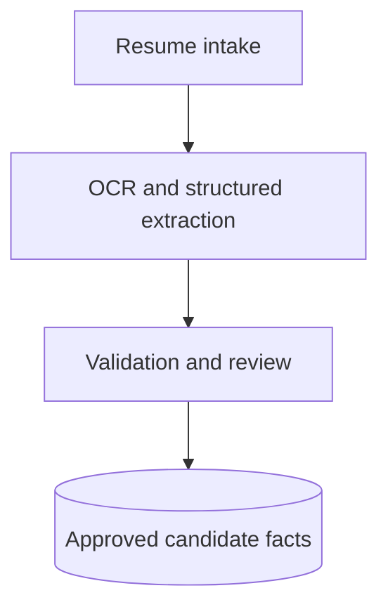
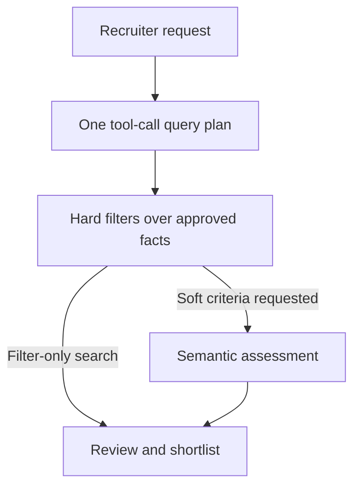

# NjordHR

**AI recruitment and document intelligence**

Turn unstructured maritime resumes into searchable candidate facts, then help recruiters find, review, and shortlist candidates using natural language.

[Architecture](docs/architecture.md) · [Evaluations](docs/evaluations.md) · [View Python example](examples/matching_demo.py) · [Workflow walkthrough](docs/walkthrough.md)

> Public engineering showcase of a privately developed application. The runnable example uses synthetic data; the full application and candidate corpus remain private.

## Engineering at a glance

- **Build and deploy:** customer and operator portals, hosted APIs, asynchronous ingestion, and GPU inference.
- **Extract domain facts:** NuExtract3 fine-tuning with PyTorch and PEFT/LoRA, plus schema validation and review gates.
- **Plan a search in one tool call:** translate recruiter intent into validated filters, paired OR branches, and separate semantic criteria.
- **Improve from evidence:** use run logs, prompt audits, and matching feedback to investigate failures and expand regression coverage.

## Selected results

| Area | Recorded evidence |
|---|---|
| Parser selection | **8 LLMs** evaluated on **80 prompts** |
| Best parser run | **99.1% filter F1**, **96.7% filter exact match** over **240 cases** |
| LoRA training | **1,463 examples**, **24K-token context**, **0.47%** trainable parameters |
| Extraction validation | **469 documents**, with field-level and schema checks |
| Known-item retrieval | **13/13 trials** against a historical **4,967-candidate** corpus |
| OCR comparison | **200 documents / 663 pages** |

These are historical, task-specific experiments. Parser scores are from the best recorded rescored run (80 prompts × 3 repeats); they do not measure overall candidate-matching accuracy. [Read the methods and limitations](docs/evaluations.md) or [inspect aggregate evidence](evidence/metrics.json).

## How it works

**Document preparation**

**Recruiter search**

The application runs on Railway with Supabase persistence and RunPod inference. Hard requirements are evaluated over approved/current facts; soft criteria receive a separate assessment. [See the full architecture and feedback loop](docs/architecture.md).

## A matching decision you can inspect

> “Indian second officers or Filipino chief officers, with tanker experience.”

The rank and nationality must stay paired in two alternative branches. Tanker experience applies to both. Missing evidence produces a review outcome; unapproved records stay out of search.

| Synthetic record | Outcome | Why |
|---|---|---|
| DEMO-001 | Match | Indian second officer; tanker evidence |
| DEMO-002 | Match | Filipino chief officer; tanker evidence |
| DEMO-003 | No match | Nationality and rank are paired incorrectly |
| DEMO-004 | Needs review | Vessel evidence is missing |
| DEMO-005 | Ineligible | Facts are not approved/current |

**[View the Python code](examples/matching_demo.py)** · [Synthetic fixtures](examples/synthetic_candidates.json) · [Run instructions](examples/README.md)

This small, standalone example illustrates the decision logic. It uses a hand-authored plan and is not the production parser or matching engine.

## Customer and operator workflows

**Recruiters**

- Search in natural language and inspect interpreted filters.
- Review candidate evidence and refine saved search runs.
- Manage verified shortlists and export records.

**Operators**

- Monitor ingestion and extraction; investigate failed runs.
- Review candidate facts before they become searchable.
- Inspect prompt audits, matching feedback, and evaluation history.

[Walk through an example](docs/walkthrough.md). The walkthrough is textual and synthetic; live product screenshots are not included.

## Technology

- **Application:** Python, Flask, React, TypeScript, Supabase/PostgreSQL.
- **Training and inference:** PyTorch, Hugging Face Transformers, PEFT/LoRA, Docker, RunPod.
- **Integrations and hosting:** Railway, Google Drive API, Selenium, email-to-cloud delivery.
- **Quality:** pytest, Vitest, model evaluation scripts, hosted smoke tests.
- **OCR experiments:** Gemini Vision, Mistral OCR, Docling, olmOCR, Chandra, Google Vision.

## Further technical detail

- [Architecture and engineering decisions](docs/architecture.md)
- [Evaluation methods, historical results, and limitations](docs/evaluations.md)
- [Recruiter and operator walkthrough](docs/walkthrough.md)
- [Runnable synthetic matching example](examples/README.md)

## Access and scope

The full implementation contains resume-derived data and operational artifacts and remains private. This repository contains newly written explanatory material, selected aggregate metrics, and synthetic examples. Additional implementation details can be discussed during a technical interview, subject to data review.

Earlier Gemini-embedding/Pinecone retrieval work is historical; it is not the authority for current candidate eligibility. No production credentials, candidate documents, model weights, or private repository history are included. No open-source license is granted by this showcase.
