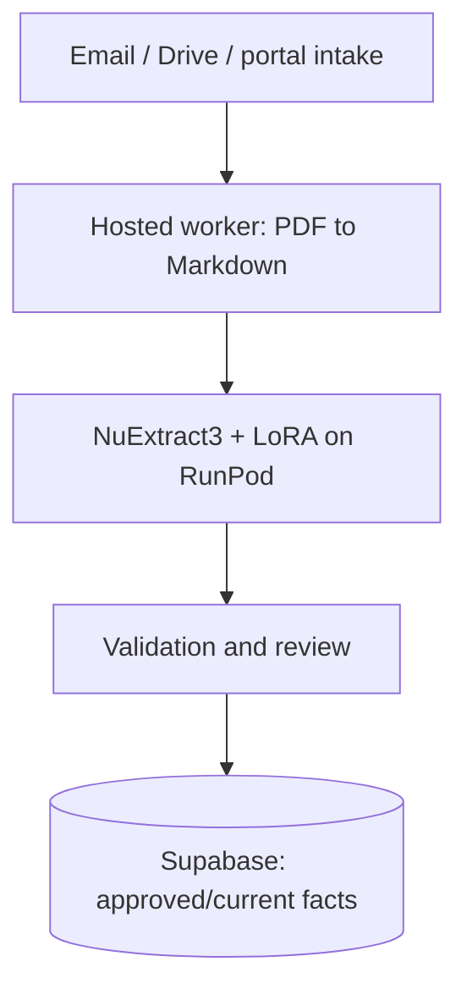
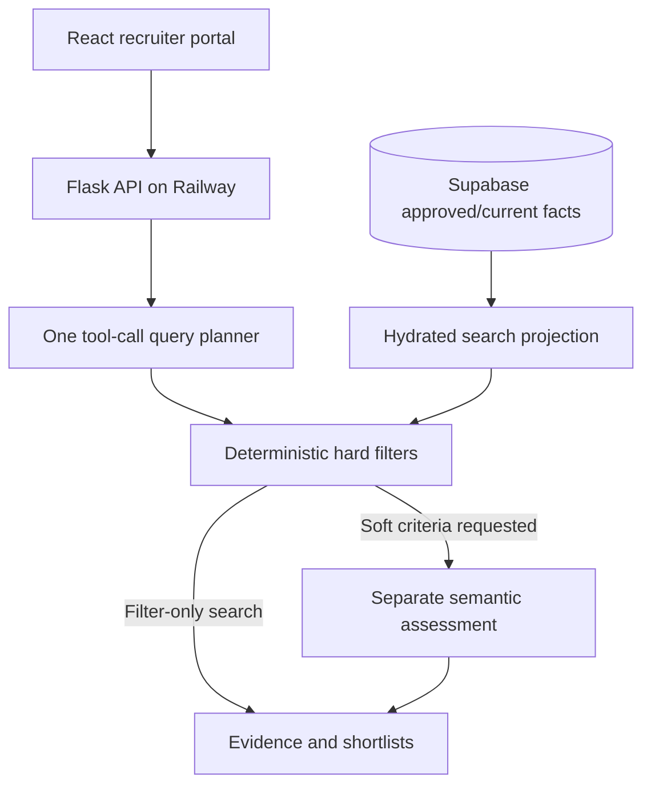
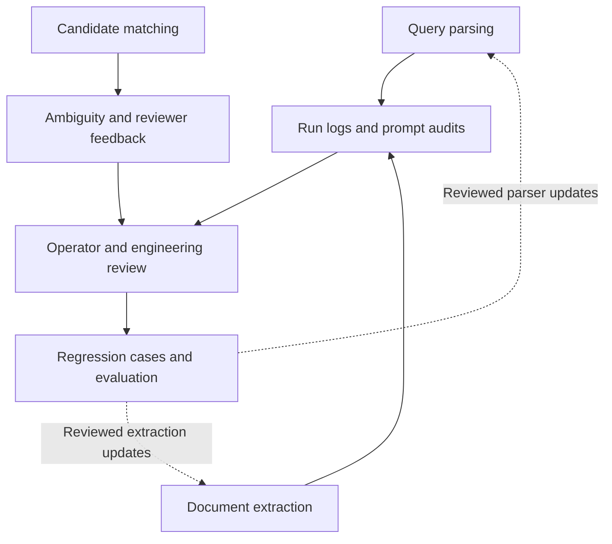

# Architecture and engineering decisions

[← Project overview](../README.md) · [Evaluation results](evaluations.md)

## Architecture maps

Three connected views separate document preparation, online search, and the engineering feedback loop. Repeated component names refer to the same system components. Solid arrows show processing or evidence flow; dashed arrows show reviewed engineering updates.

### 1. Ingestion and approved facts

The worker orchestrates document conversion and extraction. Only approved/current facts feed the search projection in the next view.

### 2. Recruiter search

The projection reports freshness and retains last-good data if hydration fails. Semantic assessment runs when requested; filter-only searches go directly to results. This view describes prompt-based search; direct filter-only requests do not require an LLM parse.

### 3. Observability and reviewed improvements

The dashed return paths represent engineering changes selected and checked using evidence. They do not represent automatic retraining or automatic acceptance of reviewer feedback as ground truth. Model changes require their own data, evaluation, and deployment decisions.

## Hosted application

The supported production shape is a Railway API engine plus hosted worker, Supabase, and a RunPod model endpoint. The working repository separates the hosted baseline (`railway-m1`) from ongoing retraining research. Historical local-agent and Electron paths are not the current product contract.

## Ingestion and extraction

Email-to-cloud delivery, Google Drive, and portal ingestion feed document processing. The worker handles conversion and structured extraction asynchronously. NuExtract3 with a LoRA adapter extracts domain facts from text/Markdown; validation and review separate generated output from approved searchable facts.

The hard document problems include repeated voyage tables, multi-value cells, credential names and dates, and the distinction between declared rank and sailed-rank history. Valid JSON is necessary but does not prove factual completeness or correctness.

## Facts and search authority

Supabase rows marked approved and current for their resume are authoritative. A hydrated local projection supports search, with visible cache freshness and last-good behavior during hydration failure. Pending/rejected extraction rows are not eligible for search.

## Query planning

One bounded LLM tool call maps the recruiter request into validated filters, optional alternative branches, semantic criteria, and unsupported intent. It does not search the corpus or perform all candidate assessments in that same call.

For example, “Indian second officers or Filipino chief officers” requires two paired branches. Combining both nationalities and both ranks into independent lists would admit unintended combinations. Negations and shared constraints also need explicit handling.

Hard filters evaluate structured facts across the eligible set. Semantic assessment is a separate, uncertain signal; unavailable evidence should not become an invented match or rejection. The historical vector retrieval path is not the source of truth for eligibility.

## Observability and improvement

Operational logs identify ingestion/extraction failures. Prompt audits and demand logs record degraded or unsupported requests. Matching audit/review records capture incorrect or ambiguous decisions and feedback. Evaluation artifacts retain model identity, settings, expected/generated results, latency, tokens, and cost where available.

Engineering review uses these records to identify missing schema capabilities, reproduce failures, add regression cases, and prioritize corrections. Logging is not automatic model retraining, and user feedback is not automatically trusted ground truth.

## Serving reliability

Recorded engineering checks include model/adapter identity verification, serial-versus-batched field-presence parity, per-document failure isolation, cloud-to-cache replacement/removal, stale-state visibility, and hosted browser/API smoke tests. Hosted batching was enabled behind a configurable switch with a conservative default of one document.
